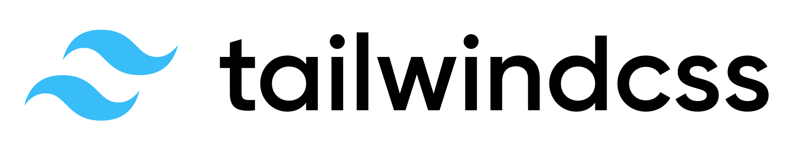
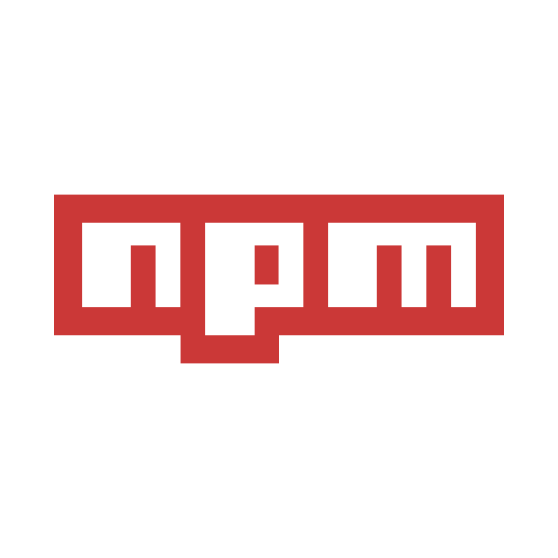

  
  
  
  
  
  
  

# Hi 👋 there!

So glad you've dropped by my coding corner. Here, it's all about web design,
coding magic.

Between coding sessions, I'm probably out cycling 🚴‍♂️ or having fun annoying my
kids (they secretly love it 😁).

Dive 👀 into my projects, see what sparks joy, and let's chat 💬 about anything
from tech to the best cycling routes.

Happy exploring!

# Project: [👉 ADD TITLE!]

### Requirements

Build out this dashboard and get it looking as close to the design as possible.

Your users should be able to:

- [👉 ADD REQUIREMENTS!]

### Tech Stack:

- HTML5;
- CSS3;
- JavaScript
- NextJS 15
- TailwindCSS
- Vite
- Npm

### Links

- Live Site URL: [GitHub Pages](https://grifano.github.io/[👉 ADD LINK!])

## Author

- Frontend Mentor -
  [Web Development](https://www.frontendmentor.io/profile/grifano)
- LinkedIn - [Serhii Orlenko](https://www.linkedin.com/in/grifano/)
